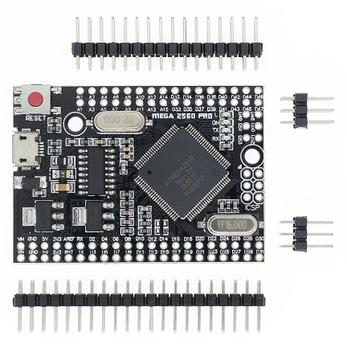
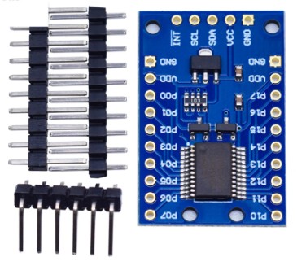
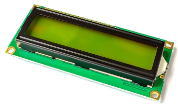

# arduino_bahnhof
modellbau bahnhofssteuerung

160 Digitalausgaenge (Relais)

ca 100 Digitaleingaenge

## hardware
- 2x arduino mega2560 pro

- 10x pcf8575 i2c io expander 16 port

- 20x 8fach relais module

- 1x 2x16 lcd i2c modul

## software
- master / slave kommunikation via uart (Serial1)
- lcd menue / bedienung mit 2 buttons (auf/select)
- befehlssteuerung mit gleisbelegt pruefung und ueberwachung um strecke wieder frei zu geben
- saemtliche eingaenge entprellt

## verbindung
- das vergisst man schnell wieder mit den relais:
    - der arduino zieht den optokoppler nach masse -> also Steuerkreis ueber VCC und INx
    - der optokoppler schließt den kreis mit dem relais ueber JD-VCC und GND -> also lastkreis ueber JD-VCC und GND

